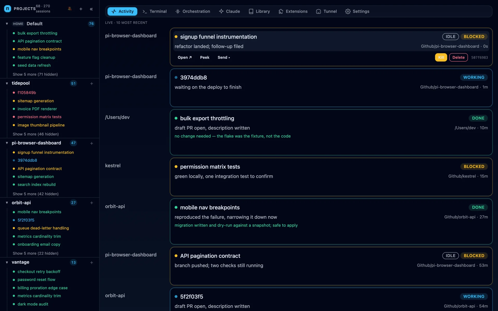
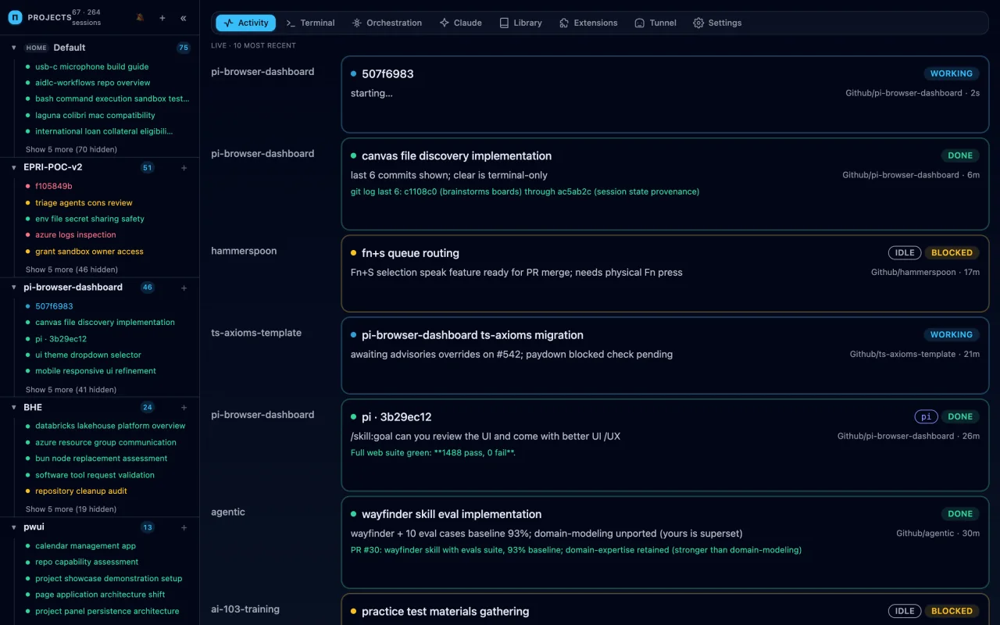
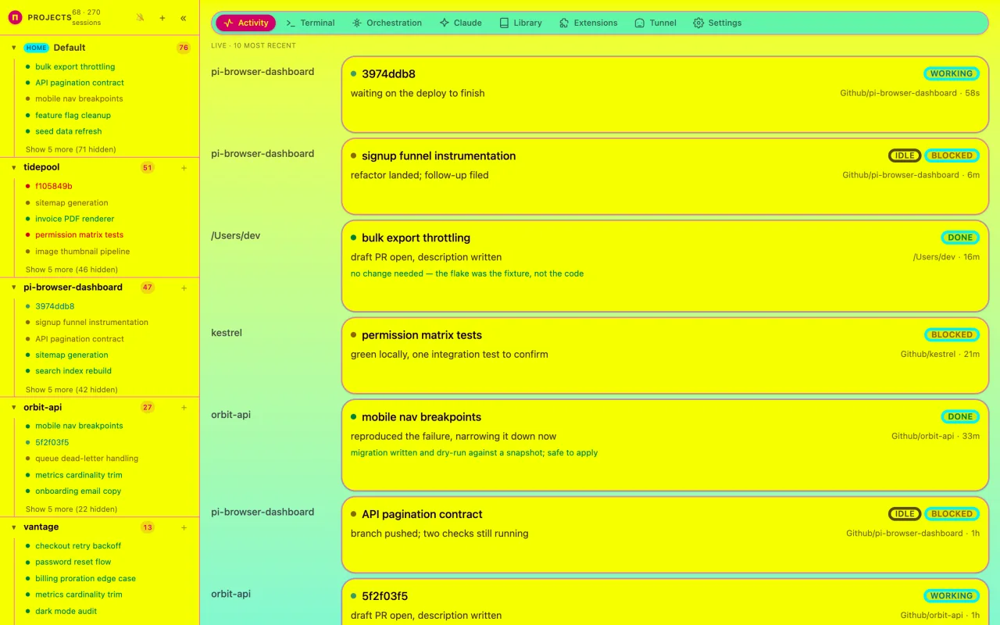

# pi-browser-dashboard

A browser front-end to Claude Code's `claude agents` background sessions. Same
supervisor, same worktrees, same auto-cleanup — different surface: a grid of
cards reachable from any device, with richer permission and artifact
rendering than a terminal can manage.

> Status: pre-1.0. APIs, file layouts, and UI all move. Pin a commit if you
> depend on a specific behavior.

[](https://pierre-mike.github.io/pi-browser-dashboard/)

**[▶ Browse the full feature tour](https://pierre-mike.github.io/pi-browser-dashboard/)**
— every feature as a still and a clip, captured from the live app, plus all
eighteen themes. Source and re-record instructions: [`doc/demo/`](./doc/demo/).

## What it does

- **Grid of session cards** — one per `claude --bg` background session,
  refreshed live via SSE from the supervisor's `roster.json` / `state.json`.
- **Dispatch bar** — type a prompt, pick agent + permission mode, spawn N
  parallel sessions in one click. Filter syntax mirrors `claude agents`
  (`a:<agent>`, `s:<state>`, `#<pr>`).
- **Drill-in transcript** — JSONL transcript renderer with tool-use,
  tool-result, and assistant blocks.
- **Browser terminal** — embedded xterm.js attached to a per-session
  `zellij` layout so you can fall back to the CLI without losing context.
- **Project view** — files, README/markdown/image/PDF previews, PR status,
  Claude config (hooks, skills, settings) browser.
- **Stateless daemon** — no database. The supervisor owns processes,
  worktrees, and persistence; the daemon is a thin watcher + shell-out.
- **Nine theme families, light and dark** — eighteen themes over one set of
  semantic tokens. A family owns its colour, its *shape* (corner radius per role,
  border width, depth) and its own sixteen-slot terminal palette, and every one is
  contrast-gated rather than eyeballed: 4.5:1 for each ink token, 7:1 for body
  text. Switch from the command palette; nothing reloads.

| | |
|---|---|
|  |  |
| `pid` — sky / slate, the default | `neon` — an electric-lemon page at 18:1 |

[All nine families, both variants →](./doc/demo/README.md#themes)

## Requirements

- [Bun](https://bun.sh) ≥ 1.1
- [Claude Code](https://claude.com/claude-code) CLI on `PATH`, interactively
  signed in at least once. The dashboard never talks to the Anthropic API
  directly — it shells out to `claude --bg`, `claude stop`, `claude rm`, etc.
- macOS or Linux. Windows is untested.
- `zellij` for the embedded terminal (optional).

## Quick start

```bash
git clone https://github.com/Pierre-Mike/pi-browser-dashboard.git
cd pi-browser-dashboard
bun install
bun run dev
```

This starts:

- daemon on `http://localhost:8787`
- web app on `http://localhost:5173`

Open the web app. The grid will populate once you spawn a session, either
from the dispatch bar or via `claude --bg "<prompt>"` in any directory.

### Environment

| Variable             | Default                  | Purpose                                 |
| -------------------- | ------------------------ | --------------------------------------- |
| `PID_DAEMON_URL`     | `http://localhost:8787`  | Web → daemon URL (used by the dev proxy) |
| `PID_WEB_PORT`       | `5173`                   | Vite dev server port                    |
| `CLAUDE_CONFIG_DIR`  | `~/.claude`              | Claude Code config root the daemon watches |
| `PID_AGENTIC_REPO_PATH` | `~/Github/agentic`    | Optional skills/agents catalog repo for the Library tab; the tab shows an empty state if absent |

## Repo layout

```
apps/
  daemon/   # Bun + Hono + Effect-TS service. Stateless.
  web/      # Vite + React + TanStack Router SPA.
  e2e/      # Playwright suite.
scripts/    # the harness: typecheck, co-location, commit-msg, debt ratchet, doctor.
biome-plugins/ # GritQL rules: no throw/await in a core, no cast .json(), one param.
.claude/loops/  # host-level launchd scripts (issue-driver pipeline)
lefthook.yml  # pre-commit (biome + test-touched) + pre-push (types, debt, unit, e2e).
.github/    # CI workflows + issue/PR templates.
AGENTS.md   # Architecture, surface area, deferred work.
CLAUDE.md   # The engineering canon (shared verbatim with AGENTS.md).
```

Package names: `@pid/daemon`, `@pid/web`, `@pid/e2e`. The daemon exports its
Hono `AppType` via `@pid/daemon/types`; the web app consumes it with
`hc<AppType>` for end-to-end typed RPC.

## Tests

```bash
bun run verify        # every gate in one shot (what CI runs)
bun run test          # co-location check + harness doctor + daemon & scripts suites
bun run test:web      # web unit suite
bun run test:cli      # cli unit suite
bun run test:e2e      # Playwright e2e
bun run typecheck     # tsc --noEmit over every workspace
bun run lint          # Biome check + fix
bun run lint:ci       # Biome check (no fix)
bun run audit         # fallow: dead code / duplication / cycles / complexity
bun run doctor        # harness self-check (also inside `test`)
bun run axiom-debt    # ratchet on the axioms with legacy debt
```

Pre-commit blocks any commit that touches `apps/*/src/**` without staging a
test. Pre-push runs the typecheck, the debt ratchet, the unit suites and the
Playwright suite. Bypasses (`SKIP_TDD=1`, `SKIP_E2E=1`) exist for docs/dep-only
commits — see `CLAUDE.md`.

## Authoring an extension

Scaffold a new iframe extension with the `pid-ext` generator:

```bash
bun run pid-ext my-ext           # local scope → <cwd>/.pid/extensions/my-ext
bun run pid-ext my-ext --global  # global scope → ~/.pid/extensions/my-ext
```

This writes two files:

| File | Purpose |
| --- | --- |
| `manifest.json` | Extension metadata (name, version, tier, tabs) |
| `index.html` | Self-contained iframe page; posts `getContext` RPC to the dashboard |

After running the generator, restart the daemon (`bun run dev:daemon`) and open
the **Extensions** tab in the dashboard — your extension's tab will appear.

The iframe RPC bridge exposes the project's repo context, each method gated by a
capability you grant per-extension in the Extensions tab:

| RPC method | Capability | Returns |
| --- | --- | --- |
| `getContext()` | _(none)_ | the project id + cwd this panel is scoped to |
| `listFiles({path})` / `readFile({path})` | `fs` | repo file tree / file contents |
| `gitStatus()` | `git` | current branch, ahead/behind, dirty entries |
| `gitLog({limit})` | `git` | recent commits (hash, author, date, subject) |
| `subscribeEvents()` | `events` | pointer to the daemon SSE stream |

Worked examples live in [`examples/extensions/`](./examples/extensions/):

- [`hello/`](./examples/extensions/hello/) — the minimal scaffold output; calls
  `getContext` and renders it.
- [`repo-explorer/`](./examples/extensions/repo-explorer/) — a project panel that
  browses the repo's file tree over the RPC bridge. Demonstrates project-scoped
  context and the permission model: it stays inert until you grant **fs** in the
  Extensions tab, then lists files (click a directory to descend). Grant **git**
  to also show the current branch and uncommitted-change count. Copy it into
  `~/.pid/extensions/` or a project's `.pid/extensions/` to try it.

## Contributing

See [CONTRIBUTING.md](./CONTRIBUTING.md) for workflow, code style, and
testing expectations. For architecture and roadmap, read `AGENTS.md`. For
vulnerabilities, see [SECURITY.md](./SECURITY.md).

## License

MIT — see [LICENSE](./LICENSE).
