# pi-browser-dashboard — Feature Demo Recordings

> **🎛️ Live feature tour:** [pierre-mike.github.io/pi-browser-dashboard](https://pierre-mike.github.io/pi-browser-dashboard/)
> — the same recordings, grouped by user story in a browsable UI ([`index.html`](./index.html),
> published to GitHub Pages by [`.github/workflows/pages.yml`](../../.github/workflows/pages.yml)).

Animated-GIF walkthroughs of every feature, recorded against the local dev app
(`bun run dev` → http://localhost:5173) by driving **headless Google Chrome** with
Playwright. One feature per recording, one browser context (tab) per recording —
kept lightweight (single panel in view, 760px / 7fps / ≤100-colour gifs).

GIFs live in [`gifs/`](./gifs/). The recorder is embedded at the bottom of this file
(kept inline rather than as a committed source file so it stays out of the lint/dead-code
audits — it is throwaway demo tooling, not app code).

## How these were made / how to re-record

```bash
# prereqs (NOT committed as repo deps — install ad hoc):
bun add -d playwright          # launches your installed Chrome via channel:'chrome'
# ffmpeg must be on PATH

bun run dev                    # start the app on :5173 (in another shell)
# save the "Recorder script" below as record.mjs at the repo root, then:
node record.mjs                # record all 19 features
node record.mjs 11             # re-record only feature 11 (canvas)
DEMO_SESSION=<id> DEMO_PROJECT=<slug> node record.mjs
```

Each clip: navigate → 3–6 deliberate actions with ~1s waits → context close flushes a
`.webm` → `ffmpeg` trims the blank pre-mount intro (`-ss 1.0`) and encodes a light gif.
The session/project IDs used as demo targets were read from the live app's rendered
`a[href*="/sessions/"]` / `a[href*="/projects/"]` links.

> The Claude-in-Chrome **extension was not connected** in this environment, so recording
> was done via headless Chrome + Playwright instead — fully automated, no extension needed.

## Feature inventory, recording scripts & gifs

### A. Home dashboard — `/`

| # | Feature | gif | What it shows |
|---|---------|-----|---------------|
| 1 | Activity feed | [`01-activity-feed.gif`](./gifs/01-activity-feed.gif) | Sessions/projects grid, live state badges, card hover. |
| 2 | Sidebar nav | [`02-sidebar.gif`](./gifs/02-sidebar.gif) | Project buckets, pinned + by-state grouping, "show more". |
| 3 | Spawn modal | [`03-spawn-modal.gif`](./gifs/03-spawn-modal.gif) | Dispatch bar: prompt box, skill chips, permission mode, N-sessions. |
| 4 | Global terminal | [`04-terminal-global.gif`](./gifs/04-terminal-global.gif) | Attached zellij "default" shell. |
| 5 | Claude config | [`05-claude-config.gif`](./gifs/05-claude-config.gif) | hooks/skills/settings.json/CLAUDE.md from ~/.claude. |
| 6 | Library | [`06-library.gif`](./gifs/06-library.gif) | Skills/agents/tools catalog + install entries. |
| 7 | Extensions | [`07-extensions.gif`](./gifs/07-extensions.gif) | Installed extensions + capability toggles. |
| 8 | Tunnel | [`08-tunnel.gif`](./gifs/08-tunnel.gif) | Cloudflare tunnel start/stop + URL controls. |

### B. Session detail — `/sessions/$id`

| # | Feature | gif | What it shows |
|---|---------|-----|---------------|
| 9 | Session controls + Peek | [`09-session-controls.gif`](./gifs/09-session-controls.gif) | Header (name/state/short id/cwd), Open-in-CLI/Peek/Delete; Peek summary. |
| 10 | Chat transcript | [`10-chat.gif`](./gifs/10-chat.gif) | JSONL transcript: tool-use / tool-result / assistant blocks. |
| 11 | Canvas | [`11-canvas.gif`](./gifs/11-canvas.gif) | JSON-Canvas editor: toolbar (Box/Link/File/Group/Export), grid, minimap, zoom. |
| 12 | Session terminal | [`12-terminal-session.gif`](./gifs/12-terminal-session.gif) | xterm attached to per-session zellij. |
| 13 | Files diff | [`13-files-diff.gif`](./gifs/13-files-diff.gif) | Worktree diff viewer. |

### C. Project detail — `/projects/$id`

| # | Feature | gif | What it shows |
|---|---------|-----|---------------|
| 14 | Project sessions | [`14-project-sessions.gif`](./gifs/14-project-sessions.gif) | Session-card grid + state pills + spawn button. |
| 15 | GitHub / PR diff | [`15-github.gif`](./gifs/15-github.gif) | PR list + inline PR-diff viewer. |
| 16 | Project terminal | [`16-terminal-project.gif`](./gifs/16-terminal-project.gif) | Shell rooted at project path. |
| 17 | Project files tree | [`17-files-tree.gif`](./gifs/17-files-tree.gif) | File tree + file preview. |
| 18 | Project Claude config | [`18-claude-project.gif`](./gifs/18-claude-project.gif) | Project `.claude` hooks/skills/settings. |
| 19 | Project Library | [`19-library-project.gif`](./gifs/19-library-project.gif) | Catalog + scope selector (all/global/local). |

## Gallery

### A. Home
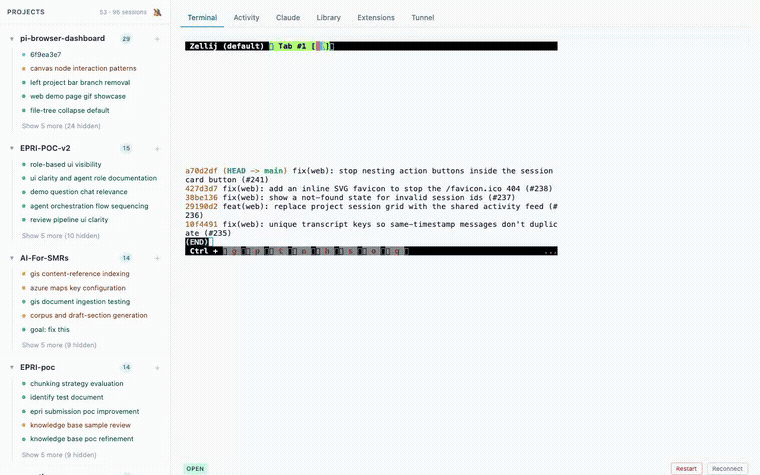
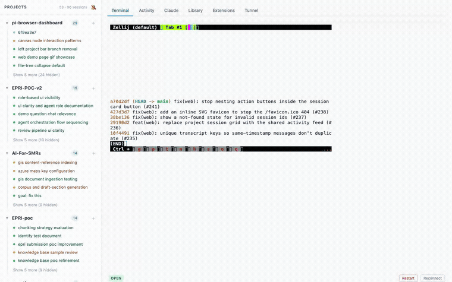
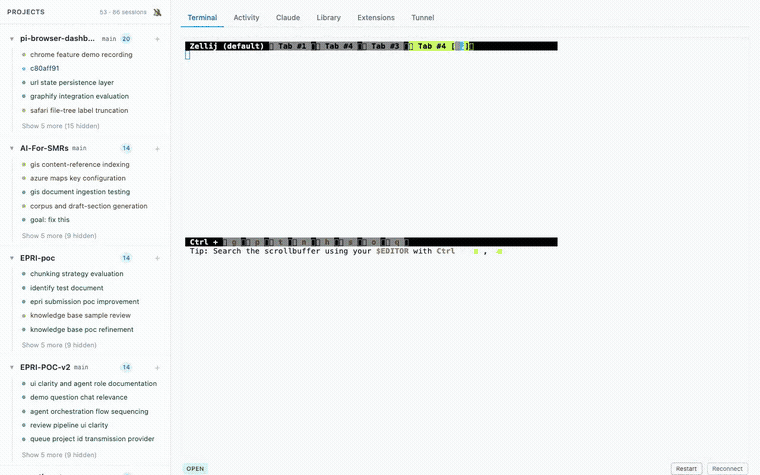
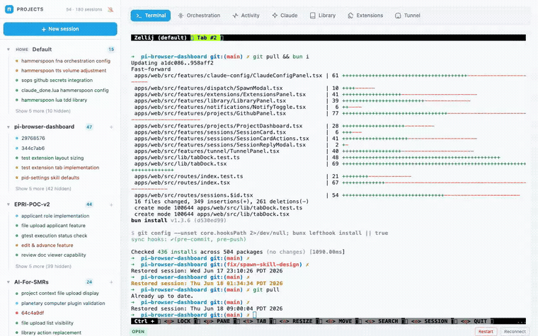
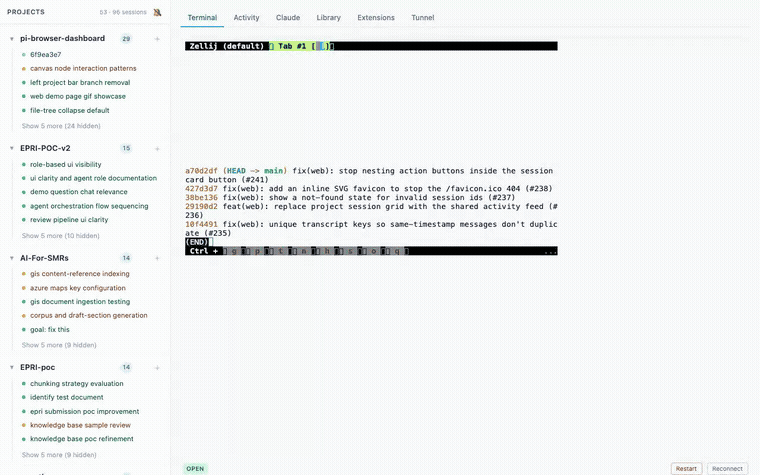
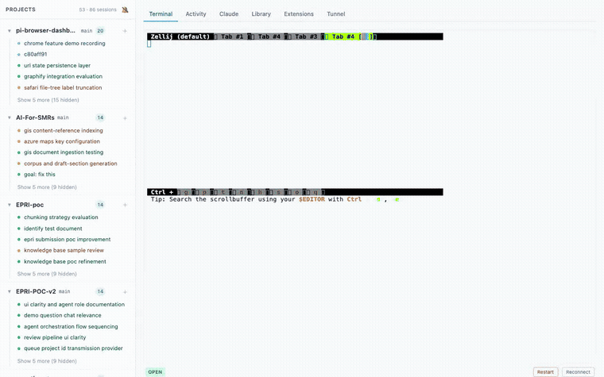
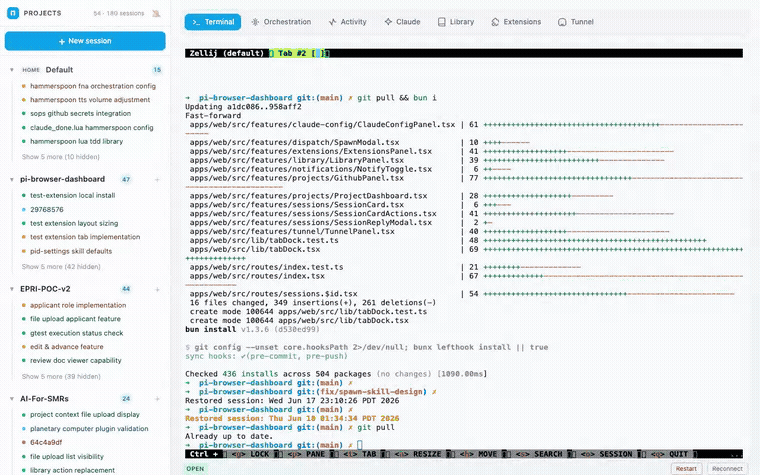
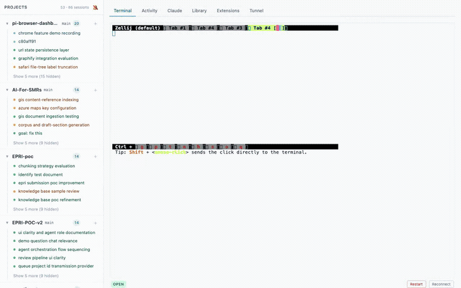

### B. Session
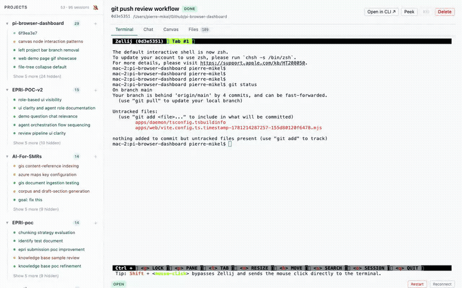
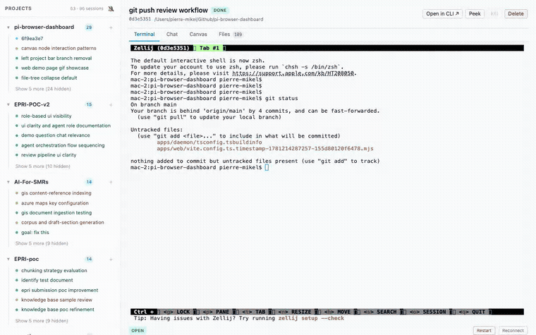
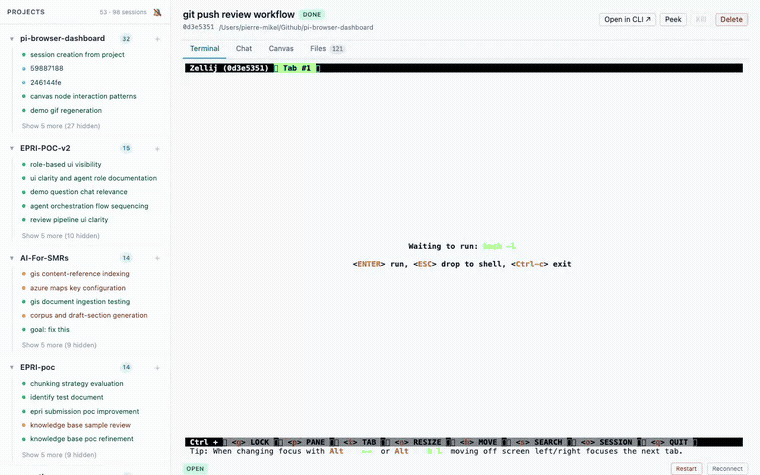
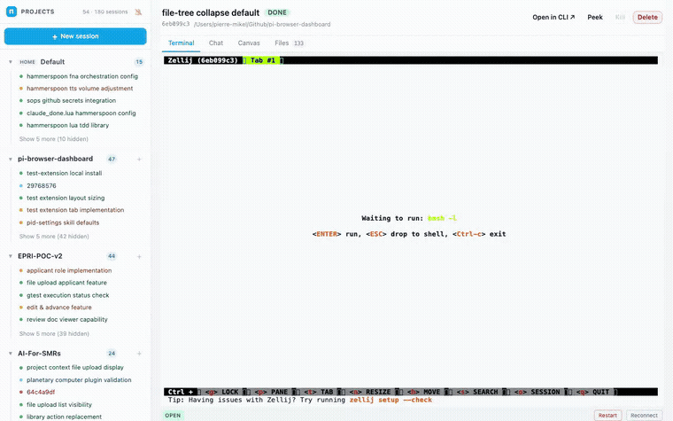
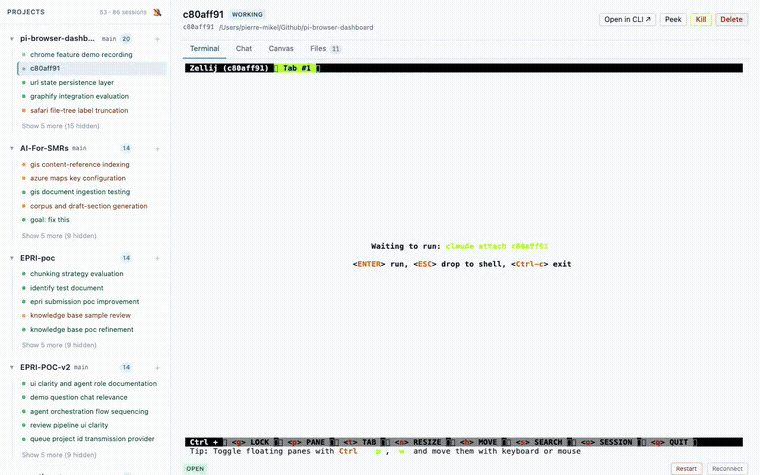

### C. Project
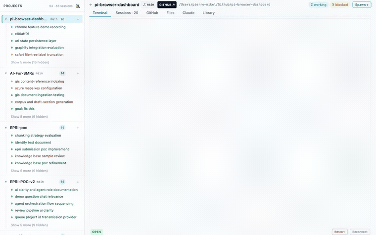
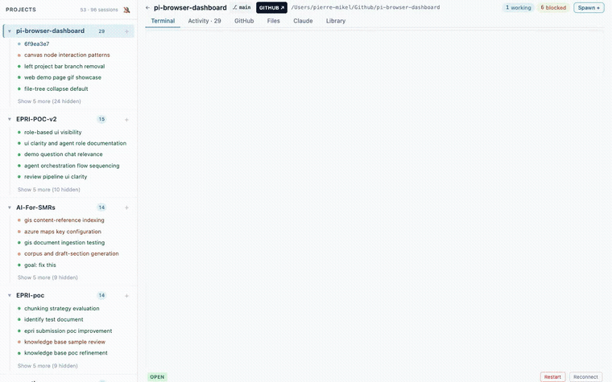
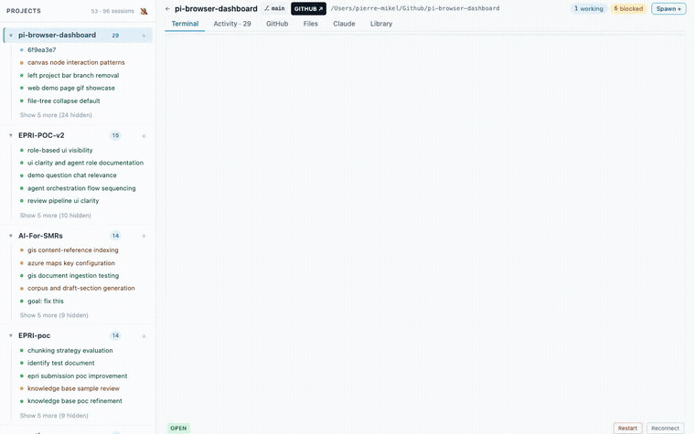
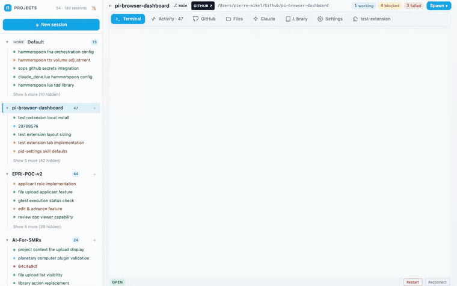
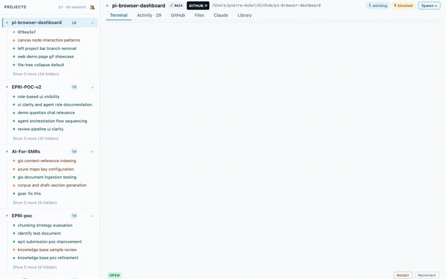
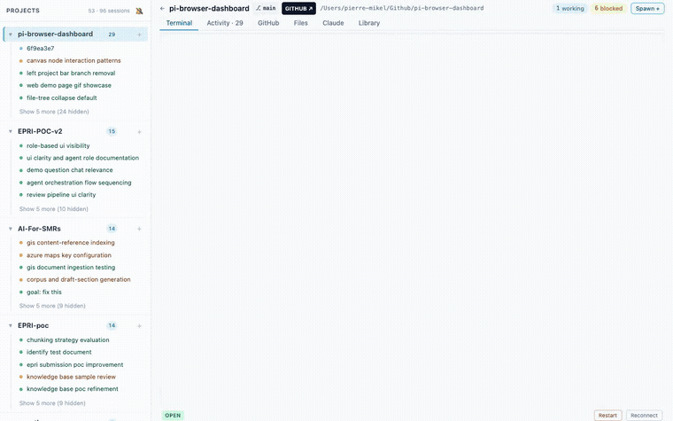

## Recorder script

<details>
<summary><code>record.mjs</code> — save at repo root, <code>node record.mjs</code></summary>

```js
// Headless-Chrome demo recorder for pi-browser-dashboard.
// One Playwright context per feature -> one .webm -> ffmpeg -> light .gif in doc/demo/gifs/.
//
// Prereqs:  bun add -d playwright   (launches installed Chrome via channel:'chrome')   +   ffmpeg on PATH
// Run from repo root with the dev app up (bun run dev -> http://localhost:5173):
//   node record.mjs            # all features
//   node record.mjs 11         # only files whose name starts with "11"
//   DEMO_SESSION=<id> DEMO_PROJECT=<slug> node record.mjs
import { chromium } from 'playwright';
import { execFileSync } from 'node:child_process';
import { mkdirSync, rmSync, statSync, mkdtempSync } from 'node:fs';
import { join, resolve } from 'node:path';
import { tmpdir } from 'node:os';

const BASE = 'http://localhost:5173';
const ROOT = resolve('.');
const VID = mkdtempSync(join(tmpdir(), 'pid-demo-'));
const GIFS = join(ROOT, 'doc', 'demo', 'gifs');
mkdirSync(GIFS, { recursive: true });

// real session/project discovered from the running app (override via env)
const SESS = process.env.DEMO_SESSION || 'c80aff91';
const PROJ = process.env.DEMO_PROJECT || 'pi-browser-dashboard';
const VW = { width: 1280, height: 800 };
const log = (...a) => console.log('[rec]', ...a);

async function clickAny(page, labels, { exact = false } = {}) {
  for (const label of labels) {
    for (const make of [
      () => page.getByRole('tab', { name: label, exact }),
      () => page.getByRole('button', { name: label, exact }),
      () => page.getByRole('link', { name: label, exact }),
      () => page.getByText(label, { exact }),
    ]) {
      try {
        const loc = make().first();
        if ((await loc.count()) && (await loc.isVisible())) {
          await loc.scrollIntoViewIfNeeded({ timeout: 1500 }).catch(() => {});
          await loc.click({ timeout: 2500 });
          log('clicked', JSON.stringify(label));
          return true;
        }
      } catch { /* try next strategy */ }
    }
  }
  log('NOTE: could not click any of', JSON.stringify(labels));
  return false;
}

async function hoverFirstCard(page) {
  for (const sel of ['a[href*="/sessions/"]', '[class*="card"]', 'a[href*="/projects/"]']) {
    const loc = page.locator(sel).first();
    try { if (await loc.count()) { await loc.hover({ timeout: 1500 }); return; } } catch {}
  }
}

const features = [
  { file: '01-activity-feed', url: '/', async run(page) {
      await page.waitForTimeout(1500); await clickAny(page, ['Activity'], { exact: true }); await page.waitForTimeout(1500);
      await hoverFirstCard(page); await page.waitForTimeout(900);
      await page.mouse.wheel(0, 350); await page.waitForTimeout(900); await page.mouse.wheel(0, -350); await page.waitForTimeout(800);
  }},
  { file: '02-sidebar', url: '/', async run(page) {
      await page.waitForTimeout(1500); await clickAny(page, ['Show 5 more', 'Show 2 more', 'Show 1 more']);
      await page.waitForTimeout(1200); await page.mouse.wheel(0, 400); await page.waitForTimeout(1000);
  }},
  { file: '03-spawn-modal', url: '/', async run(page) {
      await page.waitForTimeout(1500); await clickAny(page, ['Spawn session', 'Spawn', 'New session', '+']);
      await page.waitForTimeout(2000); await page.keyboard.press('Escape'); await page.waitForTimeout(700);
  }},
  { file: '04-terminal-global', url: '/', async run(page) {
      await page.waitForTimeout(1200); await clickAny(page, ['Terminal'], { exact: true }); await page.waitForTimeout(2500);
  }},
  { file: '05-claude-config', url: '/', async run(page) {
      await page.waitForTimeout(1200); await clickAny(page, ['Claude'], { exact: true }); await page.waitForTimeout(2200);
      await page.mouse.wheel(0, 400); await page.waitForTimeout(900);
  }},
  { file: '06-library', url: '/', async run(page) {
      await page.waitForTimeout(1200); await clickAny(page, ['Library'], { exact: true }); await page.waitForTimeout(2200);
      await page.mouse.wheel(0, 350); await page.waitForTimeout(900);
  }},
  { file: '07-extensions', url: '/', async run(page) {
      await page.waitForTimeout(1200); await clickAny(page, ['Extensions'], { exact: true }); await page.waitForTimeout(2200);
  }},
  { file: '08-tunnel', url: '/', async run(page) {
      await page.waitForTimeout(1200); await clickAny(page, ['Tunnel'], { exact: true }); await page.waitForTimeout(2200);
  }},
  { file: '09-session-controls', url: `/sessions/${SESS}`, async run(page) {
      await page.waitForTimeout(2000); await clickAny(page, ['Peek']); await page.waitForTimeout(2500);
  }},
  { file: '10-chat', url: `/sessions/${SESS}`, async run(page) {
      await page.waitForTimeout(1500); await clickAny(page, ['chat', 'Chat'], { exact: true }); await page.waitForTimeout(1500);
      await page.mouse.wheel(0, 600); await page.waitForTimeout(900); await page.mouse.wheel(0, 600); await page.waitForTimeout(900);
  }},
  { file: '11-canvas', url: `/sessions/${SESS}`, async run(page) {
      await page.waitForTimeout(1500); await clickAny(page, ['canvas', 'Canvas'], { exact: true }); await page.waitForTimeout(2500);
      await page.mouse.wheel(0, 200); await page.waitForTimeout(800);
  }},
  { file: '12-terminal-session', url: `/sessions/${SESS}`, async run(page) {
      await page.waitForTimeout(1500); await clickAny(page, ['terminal', 'Terminal'], { exact: true }); await page.waitForTimeout(2500);
  }},
  { file: '13-files-diff', url: `/sessions/${SESS}`, async run(page) {
      await page.waitForTimeout(1500); await clickAny(page, ['Files', 'files'], { exact: true }); await page.waitForTimeout(2200);
      await page.mouse.wheel(0, 400); await page.waitForTimeout(800);
  }},
  { file: '14-project-sessions', url: `/projects/${PROJ}`, async run(page) {
      await page.waitForTimeout(2000); await hoverFirstCard(page); await page.waitForTimeout(900);
      await page.mouse.wheel(0, 350); await page.waitForTimeout(900);
  }},
  { file: '15-github', url: `/projects/${PROJ}`, async run(page) {
      await page.waitForTimeout(1500); await clickAny(page, ['GitHub'], { exact: true }); await page.waitForTimeout(2500);
      await page.mouse.wheel(0, 400); await page.waitForTimeout(900);
  }},
  { file: '16-terminal-project', url: `/projects/${PROJ}`, async run(page) {
      await page.waitForTimeout(1500); await clickAny(page, ['Terminal'], { exact: true }); await page.waitForTimeout(2500);
  }},
  { file: '17-files-tree', url: `/projects/${PROJ}`, async run(page) {
      await page.waitForTimeout(1500); await clickAny(page, ['Files'], { exact: true }); await page.waitForTimeout(2000);
      await page.mouse.wheel(0, 300); await page.waitForTimeout(900);
  }},
  { file: '18-claude-project', url: `/projects/${PROJ}`, async run(page) {
      await page.waitForTimeout(1500); await clickAny(page, ['Claude'], { exact: true }); await page.waitForTimeout(2200);
      await page.mouse.wheel(0, 350); await page.waitForTimeout(900);
  }},
  { file: '19-library-project', url: `/projects/${PROJ}`, async run(page) {
      await page.waitForTimeout(1500); await clickAny(page, ['Library'], { exact: true }); await page.waitForTimeout(2200);
  }},
];

const only = process.argv[2];

function toGif(webm, gifPath) {
  // -ss 1.0 trims the blank pre-React-mount intro; lighten: 7fps, 760px, 100 colors
  const vf = 'fps=7,scale=760:-1:flags=lanczos,split[s0][s1];[s0]palettegen=max_colors=100[p];[s1][p]paletteuse=dither=bayer';
  execFileSync('ffmpeg', ['-y', '-ss', '1.0', '-i', webm, '-vf', vf, '-loop', '0', gifPath], { stdio: 'ignore' });
}

async function launch() {
  try { return await chromium.launch({ channel: 'chrome', headless: true }); }
  catch { return await chromium.launch({ headless: true }); }
}

const browser = await launch();
const results = [];
for (const f of features) {
  if (only && !f.file.startsWith(only)) continue;
  const ctx = await browser.newContext({ viewport: VW, recordVideo: { dir: VID, size: VW } });
  const page = await ctx.newPage();
  let err = null;
  try {
    await page.goto(BASE + f.url, { waitUntil: 'domcontentloaded', timeout: 20000 });
    await f.run(page);
  } catch (e) { err = e.message; log(f.file, 'ERROR', e.message); }
  const video = page.video();
  await ctx.close(); // flushes video to disk
  let gif = null, bytes = 0;
  try {
    const webm = await video.path();
    const gifPath = join(GIFS, `${f.file}.gif`);
    toGif(webm, gifPath);
    bytes = statSync(gifPath).size;
    gif = `${f.file}.gif`;
  } catch (e) { err = `${err ? `${err} | ` : ''}gif:${e.message}`; }
  log(`done ${f.file} gif=${gif} ${(bytes / 1024).toFixed(0)}KB ${err ? `ERR=${err}` : ''}`);
  results.push({ file: f.file, gif, kb: Math.round(bytes / 1024), err });
}
await browser.close();
rmSync(VID, { recursive: true, force: true });
console.log(`RESULTS_JSON=${JSON.stringify(results)}`);
```

</details>

